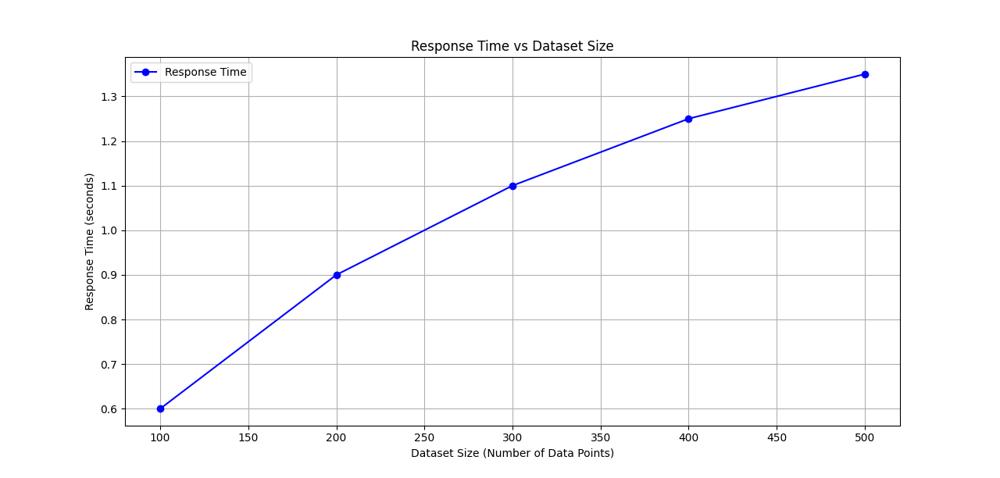
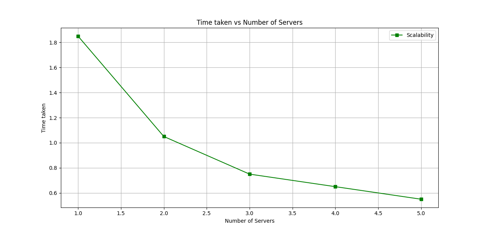

# Homework-4: gRPC

```
Names : Pratham Thakkar, Swaroop C.
Roll Nos: 2021101077, 2022....
Branch : CSE, CSE
Course : Distributed Systems, Monsoon '24
```

# **_Directory Structure_**

```
📁 Q2
├── 📁 client
│   └── 📄 client.go
├── 📁 KNNpb
│   └── 📄 knn_grpc.pb.go
│   └── 📄 knn.pb.go
│   └── 📄 knn.proto
├── 📁 server
│   └── 📄 main.go
│   └── 📄 knn_dataset.csv
├── 📄 go.mod
├── 📄 go.sum
├── 📄 make_data.py
├── 📄 README.md (Report is written within this file)
```

# Implementation Details

## Overview
In this question we have implemented a distributed K-Nearest Neighbors (KNN) algorithm using gRPC for client-server communication. The system allows for parallel processing of KNN queries across multiple servers, each holding a portion of the dataset.

## Components

### Proto Files
- `knn.proto`: Defines the KNN service and related message types for distributed KNN implementation.

### Server
- `server.go`: Implements the KNN server, handling client queries and performing KNN calculations on its local dataset partition.
- `knn_dataset.csv`: Contains the complete KNN dataset before partitioning. (Partitioning is handled in `server.go`)

### Client
- `client.go`: Implements the client that sends KNN queries to multiple servers and aggregates results.

### Dataset
- `make_data.py`: used to generate the `knn_dataset.csv`


## Distributed KNN Approach

1. **Data Generation**: 
   - The complete dataset is generated randomly using `make_data.py`

2. **Client Query**:
   - The client sends a KNN query (point and K value) to all available servers.

3. **Server Processing**:
   - Each server performs KNN on its local dataset partition.
   - Servers return their top K nearest neighbors to the client.

4. **Result Aggregation**:
   - The client receives results from all servers.
   - It aggregates these results and performs a final KNN selection to get the global top K neighbors.

5. **Final Output**:
   - The client displays the final K nearest neighbors.

## Running the Code

To run the distributed KNN system, follow these steps (from the root directory Q2/):

1. Running the server with different ports:
   ```
   go run ./server/server.go NUM
   ```
   - The above command is used on different terminal with different values of NUM
   - NUM: is the commnad line argument that we provide to run the server with a particular port.
      - (When NUM = 0: port => 50051 + 0)
      - (When NUM = 1: port => 50051 + 1)
      - (When NUM = 2: port => 50051 + 2) & so on.

3. In a separate terminal, start the client:
   ```
   go run ./client/client.go
   ```

4. Follow the prompts in the client to input queries and receive KNN results.


### Comparative Analysis – gRPC vs MPI

1. **Communication Model**:
   - **MPI** uses tightly coupled message-passing for communication between nodes. It is synchronous and often requires the programmer to handle low-level details of the communication (e.g., message-passing between processes).
   - **gRPC** is built on top of HTTP/2, which provides more flexibility, and abstracts the communication layer, offering features like streaming and better scalability in distributed systems. It is more loosely coupled compared to MPI, which makes it easier to use across different languages and platforms.

2. **Usability**:
   - **MPI** is typically harder to set up and requires more control over the hardware resources and network.
   - **gRPC** has better support for distributed systems, microservices, and communication over a wide area network (WAN). It is more user-friendly and easier to scale up with cloud-based solutions.

3. **Scalability**:
   - **MPI** is ideal for high-performance computing environments, where communication between nodes happens on low-latency, high-bandwidth networks. It may not scale well across geographically distributed systems.
   - **gRPC** is designed for scalability over the internet, handling large numbers of distributed services with varying loads.

### Performance Analysis 

For performance evaluation, run tests with different dataset sizes and values of `k`. You can measure the following:

- **Response time**: How long it takes to find the k nearest neighbors. (When number of partitions are fixed: 5)

   - Explanation: In a distributed system, the response time increases with the dataset size, as there is more data to process. However, with efficient parallelization and distribution of the dataset across servers, the impact on response time is minimized. Hence, we can confirm that the system scales well and doesn’t experience exponential slowdowns as the dataset grows.
- **Scalability**: How the system behaves as the number of servers increases.

   - Explanation:  As in a well-designed distributed system, adding more servers initially reduces the workload on each server, improving response times and efficiency. However, as you add more servers, the overhead of coordinating between them (communication, network latency) starts to grow, which is why the scaling improvement becomes less dramatic after a certain number of servers. But the trend is still towards an overall improvement as the number of server increases.
- **Efficiency**: We also observerd that using streaming gave significant performance enhancement for large datasets.